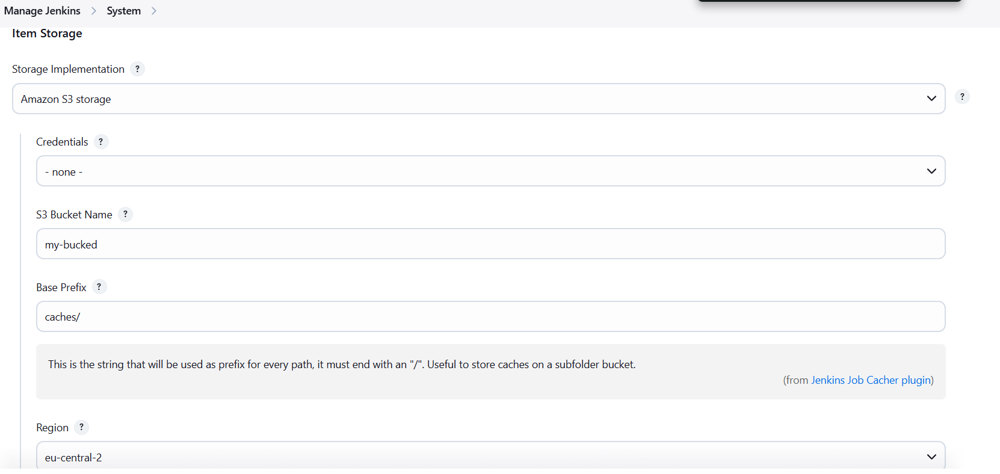

# Jobcacher S3 Extension plugin

This plugin is an extension of the [jobcacher-plugin](https://plugins.jenkins.io/jobcacher/) that allows you to store the caches in S3 compliant storage

This was extracted from `jobcacher` since this [PR](https://github.com/jenkinsci/jobcacher-plugin/pull/408)

## Introduction

### Getting started

You only need to configure the extension to use S3 under System Configuration.



### Configuration as Code

#### S3

```yaml
unclassified:
  globalItemStorage:
    storage:
      s3:
        bucketName: "caches"
        prefix: "the-prefix/"
        credentialsId: "s3"
        region: "eu-central-2"

```

#### S3 with endpoint

```yaml
unclassified:
  globalItemStorage:
    storage:
      nonAWSS3:
        bucketName: "caches"
        prefix: "the-prefix/"
        credentialsId: "s3"
        endpoint: "http://localhost:9000"
        parallelDownloads: false
        pathStyleAccess: true
        region: "eu-central-2"

```

## CONTRIBUTING

See [CONTRIBUTING](CONTRIBUTING.md)

## LICENSE

Licensed under MIT, see [LICENSE](LICENSE.md)

